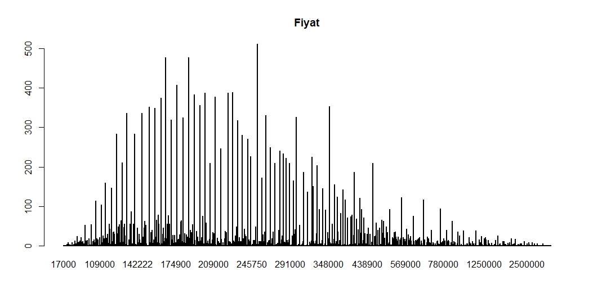
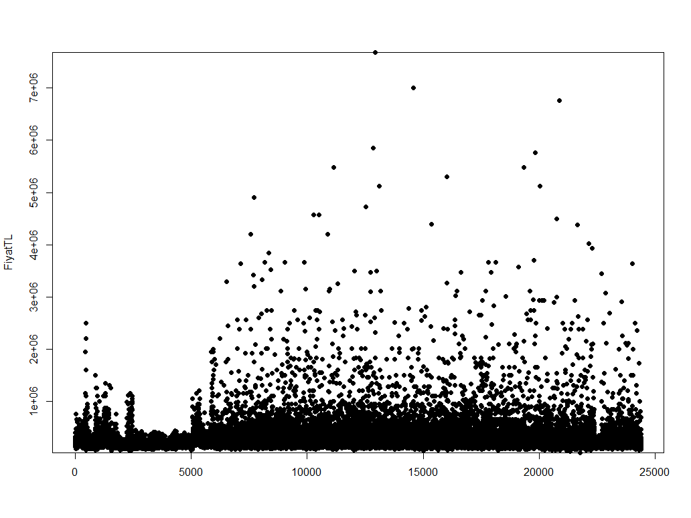
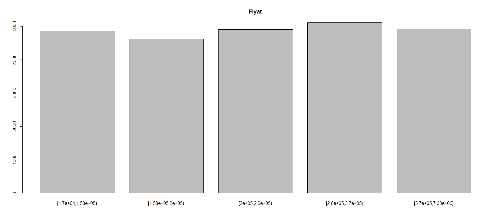

# Data Information

This data contains some information about house information in Antalya. This data contains **25276** rows and **24** columns. Column names and their types are given in the following table:

```{r}
load("house.data")
data <- antalya_train
dataFrame <- data.frame(data)
knitr::kable(sapply(dataFrame, class), col.names = c("Column Types"))
```

There are also some empty values in columns. They are converted to **NA** values. **NA** numbers for each column are given in the following table. 

```{r}
knitr::kable(colSums(is.na(dataFrame)), col.names = c("NA Numbers"))
```

As it can be seen only the "GercekYas" column has NA values. 

# Data Modification
## Empty fields are changed to NA
The first modification is converting the "empty" entry to NA. So it makes easier to handle such data.

## "MustakilMi" column type's changed to factor.
"MustakilMi" field is a boolean-like field. This column contains 0 and 1. This column is converted to a factor with yes (for 1) and no (for 0) levels. 

|MustakilMi | Count |
|:----------|-------:|
|no         |   24048|
|yes        |    1228|

## New column "OdaBilgisi" is defined and room related columns are merged.
A new column that is called "OdaBilgisi" defined. Because generally houses are defined with both room and sitting room number. By inspiring that the "OdaSayisi" and "SalonSayisi" columns are merged. After that this column is converted to factor. After this step "OdaSayisi", "Salon Sayisi" and "ToplamOdaSayisi" columns are removed.This factor can get several fields these are given in the following table.

|OdaBilgisi | Count|
|:----------|-------:|
|1 + 0      |      29|
|1 + 1      |    2346|
|1 + 2      |       1|
|1 + 3      |       1|
|10 + 1     |       1|
|10 + 2     |       1|
|10 + 3     |       1|
|10 + 4     |       1|
|10 + 5     |       1|
|10 + 9     |       1|
|11 + 2     |       1|
|12 + 2     |       1|
|12 + 3     |       1|
|12 + 4     |       1|
|13 + 3     |       1|
|15 + 3     |       1|
|16 + 16    |       1|
|16 + 4     |       2|
|16 + 8     |       1|
|17 + 2     |       1|
|18 + 8     |       1|
|2 + 0      |      23|
|2 + 1      |   10409|
|2 + 2      |      52|
|20 + 20    |       1|
|3 + 1      |    8392|
|3 + 2      |      83|
|3 + 3      |       2|
|32 + 1     |       1|
|4 + 0      |      10|
|4 + 1      |    2182|
|4 + 2      |     232|
|4 + 3      |       2|
|4 + 4      |       7|
|5 + 0      |       1|
|5 + 1      |     886|
|5 + 2      |     173|
|5 + 3      |       4|
|5 + 4      |       1|
|5 + 5      |       1|
|6 + 1      |     242|
|6 + 2      |      60|
|6 + 3      |       9|
|7 + 1      |      46|
|7 + 2      |      15|
|7 + 3      |       3|
|8 + 1      |      14|
|8 + 2      |      10|
|8 + 3      |       2|
|8 + 4      |       2|
|9 + 1      |      10|
|9 + 2      |       3|
|9 + 3      |       2|
|9 + 4      |       1|

When the attribute evaluation is done with respect to "FiyatTL" attribute, it can be seen from the table that the dependency value of newly added column "OdaBilgisi" higher than all of "OdaSayisi", "SalonSayisi" and "ToplamOdaSayisi" columns. 

|                |Relatedness|
|:---------------|---------:|
|OdaSayisi       | 0.0016720|
|SalonSayisi     | 0.0001621|
|ToplamOdaSayisi | 0.0016838|
|OdaBilgisi      | 0.0046383|

## Columns which are related are merged into a single column.
It is realized that some fields are indicating same attribute. These fields are indicated with numbers 1 and 0. If that field is 1, it means this entry contains that attribute and the other way around. In short, it acts like a boolean field.   

### "ManzaraGol", "ManzaraDeniz", "ManzaraBogaz", "ManzaraSehir" and "ManzaraDoga" Fields
 These five fields indicates the same attribute of the data that is the view attribute. Instead of using five different boolean-like columns, it can be merged as a factor column. That column is called "Manzara". The inital four "Cephe*" columns are removed from the data. It can take following values: 
 
|Manzara                | Count  |
|:----------------------|-------:|
|Doga                   |      17|
|ManazaraYok            |      26|
|DenizDoga              |       7|
|Deniz                  |      23|
|BogazDoga              |     332|
|DenizBogazDoga         |       6|
|DenizBogaz             |      16|
|GolDoga                |       8|
|GolBogazDoga           |      16|
|Gol                    |     511|
|Bogaz                  |     230|
|GolDenizDoga           |     518|
|GolBogaz               |    2863|
|BogazSehirDoga         |      14|
|Sehir                  |       1|
|SehirDoga              |       1|
|DenizSehir             |       1|
|DenizSehirDoga         |       1|
|DenizBogazSehirDoga    |       6|
|GolDenizBogazSehirDoga |       1|
|GolSehir               |       1|
|GolBogazSehir          |       6|
|GolDenizSehirDoga      |       8|
|DenizBogazSehir        |      10|
|BogazSehir             |       2|
|GolDenizSehir          |   13705|
|GolSehirDoga           |    2882|
|GolDeniz               |    2216|

For some rows, all of the initial "Manzara" columns are 0. It is considered as there is no view at all. That factor is called "ManzaraYok". 

|                |Relatedness|
|:---------------|---------:|
|ManzaraSehir    | 0.0000758|
|ManzaraDoga     | 0.0000823|
|ManzaraGol      | 0.0000444|
|ManzaraDeniz    | 0.0002354|
|ManzaraBogaz    | 0.0000503|
|Manzara         | 0.0014484|

The table shows attribute evaluations with respect to "FiyatTL". It is clear that merging "Manzara-" columns increases the value.

### "CepheBati", "CepheDogu", "CepheGuney" and "CepheKuzey" Fields 
These four fields indicates the same attribute of the data that is the side attribute. Instead of using four different boolean-like columns, it can be merged as a factor column. That column is called "Cephe". The inital four "Cephe*" columns are removed from the data. It can take following values:
  
|Cephe              | Count  |
|:------------------|-------:|
|GuneyDogu          |     245|
|Bati               |     256|
|KuzeyGuneyDogu     |     267|
|GuneyDoguBati      |    1489|
|KuzeyGuneyDoguBati |    2148|
|KuzeyDoguBati      |    3197|
|KuzeyDogu          |    2558|
|KuzeyGuneyBati     |     148|
|GuneyBati          |     948|
|KuzeyBati          |    1048|
|DoguBati           |    1470|
|Guney              |     399|
|Dogu               |    2790|
|KuzeyGuney         |    3676|
|Kuzey              |    2789|

 Yet it is realized that some column's "CepheBati", "CepheDogu", "CepheGuney" and "CepheKuzey" are all 0. For those kind of data "Cephe" fields are set to NA. Number of NA values for "Cephe" column is **3428**. It can be considered as some serious number of data. Instead of deleting those data, it is tried to be filled. First of all is is considered as "KuzeyGuneyDoguBati" if the "MustakilMi" column's value is "yes". Otherwise the  most related columns are tried to be found (Gini estimator is used.): 
 
|              |CepheKuzey    |CepheGuney    |CepheDogu     |CepheBati     |
|:-------------|--------------|--------------|--------------|-------------:|
|Ilce          | **0.0254242**| 0.0061184    | **0.0089700**| **0.0078112**|
|Mahalle       | **0.0443875**| **0.0226389**| **0.0213966**| **0.0202633**|
|MustakilMi    | 0.0009665    | 0.0003547    | 0.0011038    | 0.0017228    |
|OrijinalAlan  | 0.0123646    | 0.0065836    | 0.0034200    | 0.0034699    |
|AlanMetrekare | 0.0123570    | 0.0062361    | 0.0032774    | 0.0033828    |
|BanyoSayisi   | 0.0015910    | 0.0018118    | 0.0002022    | 0.0009455    |
|FiyatTL       | 0.0038907    | 0.0043745    | 0.0009105    | 0.0005756    |
|ToplamKat     | 0.0005785    | 0.0016701    | 0.0001222    | 0.0006236    |
|BulunduguKat  | 0.0010074    | 0.0010162    | 0.0004923    | 0.0003838    |
|GercekYas     | 0.0020330    | 0.0003702    | 0.0005473    | 0.0003022    |
|Isitma        | 0.0053332    | 0.0013525    | 0.0008965    | 0.0010985    |
|OdaBilgisi    | 0.0168020    | **0.0072207**| 0.0057354    | 0.0062768    |
|Manzara       | 0.0042536    | 0.0052831    | 0.0032078    | 0.0031190    |

Here as it can be seen from the table each "Cephe-" columns there are different related attributes. Data is filtered for each columns by using top two attributes. If such data exist then the most used "Cephe-" value is added to the "Cephe" tag. Let's take "CepheKuzey" as an example. Attributes "Ilce" and "Mahalle" are the most related attributes for "CepheKuzey" column. This is why rows whose data matches with a row, whose "Cephe" attribute is NA, are found. 

When those operations are made, the number of NA values for "Cephe" column is decreased to **471**. Now we can delete rows with NA values. 

|              |Relatedness|
|:-------------|---------:|
|CepheBati     | 0.0000584|
|CepheDogu     | 0.0000558|
|CepheGuney    | 0.0001250|
|CepheKuzey    | 0.0001024|
|Cephe         | 0.0009817|

The table shows the attribute evaluation values with respect to "FiyatTL". The value is increased after these opeartions.

## Id column is reomved.
Id column is removed. It has unique value for every data. This means it does not contain any useful information.

## Rows with the NA values are deleted.
The "GercekYas" column there were **33** NA values. Since the number is pretty low these are removed.

## Results of the modification
All in all after some modifications on data, row count became 24773 and row count became 14. Column types are changed as following:

|              |Column Types |
|:-------------|:------------|
|Ilce          |factor       |
|Mahalle       |factor       |
|MustakilMi    |factor       |
|OrijinalAlan  |numeric      |
|AlanMetrekare |numeric      |
|BanyoSayisi   |integer      |
|FiyatTL       |numeric      |
|ToplamKat     |integer      |
|BulunduguKat  |integer      |
|GercekYas     |integer      |
|Isitma        |factor       |
|OdaBilgisi    |factor       |
|Manzara       |factor       |
|Cephe         |factor       |

Moreover, all of the NA values are changed or removed from data.

# Outlier Detection
## Outlier Detection with IQR
IQR method is used to detect the following columns' outliers.  

### IQR Results

**"OrjinalAlan" Column**

Outlier calculation with upper limit 0.985 and lower limit 0.015. 

|Ilce       |Mahalle    |MustakilMi | OrijinalAlan| AlanMetrekare| BanyoSayisi| FiyatTL| ToplamKat| BulunduguKat| GercekYas|Isitma         |OdaBilgisi |Manzara       |Cephe      |
|:----------|:----------|:----------|------------:|-------------:|-----------:|-------:|---------:|------------:|---------:|:--------------|:----------|:-------------|:----------|
|Aksu       |Çamköy     |yes        |         1028|          1028|           2|  268000|         2|            0|         8|Yok            |12 + 3     |GolDenizSehir |Kuzey      |
|Aksu       |Çamköy     |yes        |         1028|          1028|           2|  280000|         2|            0|         4|Soba           |12 + 3     |GolDenizSehir |KuzeyGuney |
|Döşemealtı |Yeniköy    |yes        |          800|           672|           2|  790000|         1|            0|         8|Doğalgaz/Kombi |9 + 4      |GolDenizSehir |Kuzey      |
|Döşemealtı |Altınkale  |yes        |          900|           756|           5| 3657500|         4|            0|         3|Doğalgaz/Kombi |10 + 3     |GolBogaz      |Kuzey      |
|Aksu       |Kemerağzı  |yes        |          900|           756|           7| 4571875|         2|            0|         7|Yerden Isıtma  |8 + 3      |GolBogaz      |Kuzey      |
|Kemer      |Merkez     |no         |          871|           871|          10| 4725405|         2|            0|         2|Doğalgaz/Kombi |6 + 2      |GolDenizSehir |Kuzey      |
|Döşemealtı |Yeşilbayır |yes        |          800|           672|           6| 5303375|         2|            0|         0|Merkezi Sistem |1 + 3      |GolBogaz      |Kuzey      |

**"AlanMetreKare" Column**

Outlier calculation with upper limit 0.985 and lower limit 0.015.

|Ilce       |Mahalle          |MustakilMi | OrijinalAlan| AlanMetrekare| BanyoSayisi| FiyatTL| ToplamKat| BulunduguKat| GercekYas|Isitma         |OdaBilgisi |Manzara       |Cephe      |
|:----------|:----------------|:----------|------------:|-------------:|-----------:|-------:|---------:|------------:|---------:|:--------------|:----------|:-------------|:----------|
|Manavgat   |Sorgun           |yes        |          730|           730|           3|  900000|         3|            0|         0|Doğalgaz/Kombi |12 + 3     |GolDenizSehir |Kuzey      |
|Aksu       |Çamköy           |yes        |         1028|          1028|           2|  268000|         2|            0|         8|Yok            |12 + 3     |GolDenizSehir |Kuzey      |
|Aksu       |Çamköy           |yes        |         1028|          1028|           2|  280000|         2|            0|         4|Soba           |12 + 3     |GolDenizSehir |KuzeyGuney |
|Konyaaltı  |Hisarçandır Köyü |yes        |          727|           727|           1|  210000|         2|            0|         0|Doğalgaz/Kombi |12 + 2     |GolBogaz      |Kuzey      |
|Kepez      |Yeni             |no         |          720|           720|           6|  900000|         3|            2|        15|Doğalgaz/Kombi |8 + 1      |GolDenizSehir |Kuzey      |
|Döşemealtı |Altınkale        |yes        |          900|           756|           5| 3657500|         4|            0|         3|Doğalgaz/Kombi |10 + 3     |GolBogaz      |Kuzey      |
|Aksu       |Kemerağzı        |yes        |          900|           756|           7| 4571875|         2|            0|         7|Yerden Isıtma  |8 + 3      |GolBogaz      |Kuzey      |
|Kemer      |Merkez           |no         |          871|           871|          10| 4725405|         2|            0|         2|Doğalgaz/Kombi |6 + 2      |GolDenizSehir |Kuzey      |
|Konyaaltı  |Altınkum         |yes        |          750|           750|           6| 2743125|         4|            0|        18|Yerden Isıtma  |12 + 3     |GolDenizSehir |Kuzey      |
|Kepez      |Duacı            |yes        |          750|           750|           5| 2250000|         4|            0|        11|Merkezi Sistem |6 + 1      |GolDenizSehir |Kuzey      |
|Alanya     |Kargıcak         |yes        |          780|           780|           5| 3470968|         2|            0|         0|Merkezi Sistem |9 + 4      |GolDenizDoga  |Kuzey      |
|Kemer      |Merkez           |no         |          750|           750|          32| 3931813|         4|            2|        16|Doğalgaz/Kombi |11 + 2     |GolDenizSehir |Kuzey      |

**"FiyatTL" Column**

Outlier calculation with upper limit 0.99 and lower limit 0.01.

|Ilce       |Mahalle      |MustakilMi | OrijinalAlan| AlanMetrekare| BanyoSayisi|  FiyatTL| ToplamKat| BulunduguKat| GercekYas|Isitma         |OdaBilgisi |Manzara       |Cephe          |
|:----------|:------------|:----------|------------:|-------------:|-----------:|--------:|---------:|------------:|---------:|:--------------|:----------|:-------------|:--------------|
|Alanya     |Tophane      |yes        |          500|         420.0|           4|  9013273|         2|            0|       400|Doğalgaz/Kombi |5 + 3      |GolBogazDoga  |Kuzey          |
|Muratpaşa  |Güzeloba     |no         |          372|         372.0|           2|  4900420|         8|            1|         0|Yerden Isıtma  |12 + 2     |BogazDoga     |Kuzey          |
|Muratpaşa  |Çağlayan     |no         |          300|         300.0|           3|  4571875|         9|            9|        15|Merkezi Sistem |5 + 3      |GolDenizSehir |Kuzey          |
|Aksu       |Kemerağzı    |yes        |          900|         756.0|           7|  4571875|         2|            0|         7|Yerden Isıtma  |8 + 3      |GolBogaz      |Kuzey          |
|Döşemealtı |Yeşilbayır   |yes        |          775|         651.0|           6|  5486250|         2|            0|         0|Merkezi Sistem |1 + 3      |GolDenizSehir |Kuzey          |
|Muratpaşa  |Kılınçarslan |yes        |          380|         380.0|           6|  7350630|         2|            0|        80|Doğalgaz/Kombi |10 + 5     |GolDeniz      |DoguBati       |
|Kemer      |Merkez       |no         |          871|         871.0|          10|  4725405|         2|            0|         2|Doğalgaz/Kombi |6 + 2      |GolDenizSehir |Kuzey          |
|Konyaaltı  |Gürsu        |no         |           85|          85.0|           1|  5852000|         3|            1|         1|Doğalgaz/Kombi |5 + 0      |GolDenizSehir |Kuzey          |
|Konyaaltı  |Gürsu        |no         |          180|         180.0|           2|  7680750|         3|            2|         1|Doğalgaz/Kombi |9 + 2      |GolDenizSehir |DoguBati       |
|Muratpaşa  |Çağlayan     |no         |          700|         588.0|           4|  5120496|         3|            0|        10|Doğalgaz/Kombi |2 + 2      |GolDeniz      |Kuzey          |
|Kaş        |Bayındır     |yes        |          300|         252.0|           3|  7000600|         1|            0|        15|Doğalgaz/Kombi |9 + 2      |Gol           |GuneyDoguBati  |
|Muratpaşa  |Kılınçarslan |yes        |          450|         378.0|           6|  6217750|         2|            0|       100|Merkezi Sistem |5 + 4      |GolDeniz      |Kuzey          |
|Alanya     |Avsallar     |yes        |          380|         319.2|           3|  4389000|         3|            0|         9|Yerden Isıtma  |12 + 3     |GolDenizDoga  |Kuzey          |
|Döşemealtı |Yeşilbayır   |yes        |          800|         672.0|           6|  5303375|         2|            0|         0|Merkezi Sistem |1 + 3      |GolBogaz      |Kuzey          |
|Alanya     |Tophane      |yes        |          450|         378.0|           4| 10789625|         2|            0|       400|Doğalgaz/Kombi |1 + 3      |GolDenizDoga  |Kuzey          |
|Muratpaşa  |Şirinyalı    |yes        |          485|         407.4|           3|  5486250|         3|            0|         8|Doğalgaz/Kombi |5 + 4      |GolDenizSehir |KuzeyDogu      |
|Muratpaşa  |Şirinyalı    |no         |          400|         400.0|           4|  5760563|         8|            7|         2|Merkezi Sistem |9 + 4      |GolDenizDoga  |Kuzey          |
|Muratpaşa  |Fener        |yes        |          450|         450.0|           3|  5120500|         3|            0|        12|Merkezi Sistem |12 + 3     |GolSehirDoga  |Kuzey          |
|Konyaaltı  |Altınkum     |no         |          700|         700.0|           5|  4500000|         3|            0|         9|Doğalgaz/Kombi |4 + 3      |GolDenizSehir |KuzeyGuneyDogu |
|Alanya     |Avsallar     |no         |           75|          63.0|           1|  6766375|         8|            4|         0|Doğalgaz/Kombi |5 + 0      |GolDenizSehir |KuzeyGuneyBati |
|Muratpaşa  |Güzeloba     |yes        |          430|         430.0|           4|  4375375|         2|            0|         1|Doğalgaz/Kombi |20 + 20    |GolDenizSehir |Kuzey          |

**"BanyoSayisi" Column**

Outlier calculation with upper limit 0.99 and lower limit 0.01.

|Ilce      |Mahalle   |MustakilMi | OrijinalAlan| AlanMetrekare| BanyoSayisi|   FiyatTL| ToplamKat| BulunduguKat| GercekYas|Isitma         |OdaBilgisi |Manzara       |Cephe              |
|:---------|:---------|:----------|------------:|-------------:|-----------:|---------:|---------:|------------:|---------:|:--------------|:----------|:-------------|:------------------|
|Kepez     |Ahatlı    |no         |          100|         100.0|          11|  195000.0|         3|            2|         0|Yerden Isıtma  |5 + 0      |GolDenizSehir |KuzeyGuneyDoguBati |
|Kemer     |Merkez    |no         |          871|         871.0|          10| 4725405.0|         2|            0|         2|Doğalgaz/Kombi |6 + 2      |GolDenizSehir |Kuzey              |
|Konyaaltı |Liman     |no         |           67|          67.0|          16|  303572.5|         4|            1|         0|Doğalgaz/Kombi |2 + 1      |GolDenizSehir |GuneyDoguBati      |
|Kepez     |Kültür    |no         |          750|         630.0|          20| 2050000.0|         6|            5|         7|Doğalgaz/Kombi |9 + 1      |Deniz         |KuzeyGuneyBati     |
|Kepez     |Kuzeyyaka |no         |          135|         113.4|          14|  190000.0|         3|            3|         0|Doğalgaz/Kombi |9 + 2      |GolDenizSehir |DoguBati           |
|Kepez     |Gülveren  |no         |          600|         600.0|          16| 1900000.0|         3|            1|        11|Doğalgaz/Kombi |4 + 4      |GolDenizSehir |KuzeyGuneyDogu     |
|Kemer     |Merkez    |no         |          750|         750.0|          32| 3931812.5|         4|            2|        16|Doğalgaz/Kombi |11 + 2     |GolDenizSehir |Kuzey              |


**"ToplamKat" Column**

Outlier calculation with upper limit 0.9 and lower limit 0.1.

|Ilce      |Mahalle   |MustakilMi | OrijinalAlan| AlanMetrekare| BanyoSayisi| FiyatTL| ToplamKat| BulunduguKat| GercekYas|Isitma         |OdaBilgisi |Manzara       |Cephe          |
|:---------|:---------|:----------|------------:|-------------:|-----------:|-------:|---------:|------------:|---------:|:--------------|:----------|:-------------|:--------------|
|Alanya    |Mahmutlar |no         |           60|            60|           1|  256025|        20|            1|         3|Doğalgaz/Kombi |2 + 1      |GolDenizDoga  |KuzeyDogu      |
|Muratpaşa |Şirinyalı |no         |          110|           110|           1|  550000|        18|           14|         7|Doğalgaz/Kombi |5 + 0      |Bogaz         |KuzeyGuney     |
|Muratpaşa |Şirinyalı |no         |          360|           360|           2|  850000|        18|           -1|        12|Merkezi Sistem |1 + 2      |GolDenizSehir |Kuzey          |
|Muratpaşa |Şirinyalı |no         |          100|           100|           1|  520000|        18|           13|        13|Yerden Isıtma  |5 + 0      |GolDenizSehir |GuneyDoguBati  |
|Muratpaşa |Ermenek   |no         |          130|           130|           1|  220000|        18|            7|         7|Doğalgaz/Kombi |9 + 2      |GolDenizSehir |KuzeyGuneyBati |
|Muratpaşa |Güzeloba  |no         |          130|           130|           1|  215000|        18|            4|         4|Yerden Isıtma  |9 + 2      |GolBogaz      |Kuzey          |
|Muratpaşa |Güzeloba  |no         |          140|           140|           1|  220000|        18|            2|         4|Yerden Isıtma  |9 + 2      |GolBogaz      |KuzeyGuney     |
|Muratpaşa |Kışla     |no         |          200|           200|           2|  590000|       121|            4|        20|Doğalgaz/Kombi |12 + 2     |GolDenizSehir |DoguBati       |
|Muratpaşa |Güzeloba  |no         |          140|           140|           1|  210000|        18|           12|         5|Doğalgaz/Kombi |9 + 2      |Gol           |Kuzey          |
|Muratpaşa |Ermenek   |no         |          130|           130|           1|  195000|        18|           14|         5|Doğalgaz/Kombi |9 + 2      |Gol           |Kuzey          |
|Muratpaşa |Ermenek   |no         |          140|           140|           1|  200000|        18|            5|         5|Yerden Isıtma  |9 + 2      |GolBogaz      |Kuzey          |
|Muratpaşa |Şirinyalı |no         |           95|            95|           1|  450000|        18|            7|        12|Doğalgaz/Kombi |5 + 0      |GolDenizSehir |KuzeyDoguBati  |
|Aksu      |Altıntaş  |no         |          135|           135|           1|  200000|        18|            7|        10|Doğalgaz/Kombi |9 + 2      |GolSehirDoga  |Kuzey          |
|Korkuteli |Uzunoluk  |yes        |          200|           200|           2|  235000|       123|            0|        10|Merkezi Sistem |12 + 2     |GolDenizSehir |Guney          |
|Muratpaşa |Şirinyalı |no         |          100|           100|           1|  460000|        18|           11|        12|Doğalgaz/Kombi |5 + 0      |GolDeniz      |KuzeyGuneyBati |
|Alanya    |Kargıcak  |no         |          100|           100|           1|  375000|        20|            0|         5|Doğalgaz/Kombi |5 + 0      |GolDenizSehir |KuzeyDogu      |
|Muratpaşa |Şirinyalı |no         |          110|           110|           1|  480000|        18|           15|        12|Doğalgaz/Kombi |5 + 0      |GolDenizSehir |Guney          |

**"BulunduguKat" Column**

Outlier calculation with upper limit 0.93 and lower limit 0.07.

|Ilce      |Mahalle      |MustakilMi | OrijinalAlan| AlanMetrekare| BanyoSayisi|   FiyatTL| ToplamKat| BulunduguKat| GercekYas|Isitma         |OdaBilgisi |Manzara       |Cephe          |
|:---------|:------------|:----------|------------:|-------------:|-----------:|---------:|---------:|------------:|---------:|:--------------|:----------|:-------------|:--------------|
|Konyaaltı |Hurma        |no         |          215|         180.6|           3|  515000.0|        13|           13|         1|Doğalgaz/Kombi |9 + 4      |Gol           |Kuzey          |
|Muratpaşa |Zümrütova    |no         |          240|         201.6|           3|  850000.0|        15|           14|        13|Merkezi Sistem |5 + 3      |BogazDoga     |KuzeyGuney     |
|Kepez     |Ahatlı       |no         |          130|         109.2|           1|  175000.0|        13|           13|        23|Soba           |9 + 2      |GolBogaz      |Dogu           |
|Konyaaltı |Toros        |no         |          145|         145.0|           1|  285000.0|        13|           13|        13|Doğalgaz/Kombi |9 + 2      |Gol           |Kuzey          |
|Muratpaşa |Meltem       |no         |          150|         150.0|           1|  367000.0|        15|           15|        18|Doğalgaz/Kombi |9 + 2      |GolDenizSehir |Guney          |
|Muratpaşa |Meydankavağı |no         |          165|         165.0|           2|  300000.0|        13|           13|        14|Yerden Isıtma  |9 + 2      |GolDenizSehir |Guney          |
|Muratpaşa |Şirinyalı    |no         |          235|         235.0|           2| 1150000.0|        13|           13|        16|Yerden Isıtma  |9 + 2      |Bogaz         |KuzeyGuney     |
|Muratpaşa |Şirinyalı    |no         |          235|         235.0|           2| 1150000.0|        13|           13|        16|Yerden Isıtma  |9 + 2      |GolDenizDoga  |KuzeyGuney     |
|Muratpaşa |Meltem       |no         |          145|         145.0|           1|  310000.0|        13|           13|        16|Doğalgaz/Kombi |9 + 2      |Gol           |KuzeyGuneyBati |
|Muratpaşa |Şirinyalı    |no         |          270|         270.0|           2| 1180000.0|        13|           13|        20|Yerden Isıtma  |9 + 2      |GolDenizSehir |Kuzey          |
|Muratpaşa |Şirinyalı    |no         |          340|         285.6|           3| 2669975.0|        14|           14|        14|Merkezi Sistem |9 + 4      |GolDenizSehir |KuzeyGuney     |
|Muratpaşa |Meltem       |no         |          150|         150.0|           1|  367000.0|        15|           15|        20|Doğalgaz/Kombi |9 + 2      |GolDenizSehir |Guney          |
|Muratpaşa |Meltem       |no         |          150|         150.0|           1|  350000.0|        15|           15|        18|Doğalgaz/Kombi |9 + 2      |GolDeniz      |KuzeyGuneyBati |
|Muratpaşa |Şirinyalı    |no         |          110|         110.0|           1|  550000.0|        18|           14|         7|Doğalgaz/Kombi |5 + 0      |Bogaz         |KuzeyGuney     |
|Muratpaşa |Fener        |no         |          240|         240.0|           4| 2600000.0|        16|           15|        10|Doğalgaz/Kombi |9 + 4      |GolDenizSehir |Guney          |
|Muratpaşa |Şirinyalı    |no         |          100|         100.0|           1|  520000.0|        18|           13|        13|Yerden Isıtma  |5 + 0      |GolDenizSehir |GuneyDoguBati  |
|Muratpaşa |Fener        |no         |          450|         378.0|           3| 1828750.0|        14|           14|         8|Merkezi Sistem |5 + 3      |Gol           |KuzeyGuneyBati |
|Muratpaşa |Meltem       |no         |          145|         145.0|           1|  310000.0|        15|           13|        23|Doğalgaz/Kombi |9 + 2      |GolDenizSehir |Dogu           |
|Muratpaşa |Fener        |no         |          340|         340.0|           3| 2011625.0|        13|           13|        12|Yerden Isıtma  |5 + 3      |GolBogazDoga  |KuzeyGuney     |
|Muratpaşa |Yeşilbahçe   |no         |          200|         168.0|           2| 2432237.5|        15|           15|         8|Doğalgaz/Kombi |9 + 2      |Bogaz         |Guney          |
|Muratpaşa |Fener        |no         |          300|         300.0|           3| 3500000.0|        14|           14|         7|Yerden Isıtma  |5 + 3      |BogazDoga     |Dogu           |
|Muratpaşa |Fener        |no         |          365|         306.6|           3| 2011625.0|        14|           14|         6|Doğalgaz/Kombi |5 + 3      |GolDenizSehir |Kuzey          |
|Aksu      |Altıntaş     |no         |          110|         110.0|           1|  220000.0|        16|           14|         9|Doğalgaz/Kombi |5 + 0      |Gol           |KuzeyGuney     |
|Muratpaşa |Fener        |no         |          300|         300.0|           3| 2011625.0|        15|           15|        15|Doğalgaz/Kombi |9 + 4      |Bogaz         |Guney          |
|Muratpaşa |Meltem       |no         |          170|         170.0|           1|  450000.0|        16|           15|        16|Doğalgaz/Kombi |9 + 2      |GolDenizSehir |Kuzey          |
|Muratpaşa |Güzeloba     |no         |          450|         378.0|           2| 1750000.0|        13|           13|         7|Merkezi Sistem |5 + 3      |Bogaz         |Kuzey          |
|Muratpaşa |Fener        |no         |          240|         240.0|           3| 2600000.0|        16|           15|         5|Yerden Isıtma  |9 + 4      |BogazDoga     |GuneyDoguBati  |
|Muratpaşa |Meltem       |no         |          165|         165.0|           2|  945081.0|        16|           15|         1|Yerden Isıtma  |9 + 2      |GolDenizSehir |KuzeyGuney     |
|Muratpaşa |Ermenek      |no         |          130|         130.0|           1|  195000.0|        18|           14|         5|Doğalgaz/Kombi |9 + 2      |Gol           |Kuzey          |
|Muratpaşa |Fener        |no         |           95|          95.0|           1|  290000.0|        13|           13|         5|Doğalgaz/Kombi |5 + 0      |GolDenizSehir |Guney          |
|Kepez     |Yeni Doğan   |no         |          128|         128.0|           1|  210000.0|        13|           13|        20|Doğalgaz/Kombi |9 + 2      |GolDenizSehir |DoguBati       |
|Konyaaltı |Pınarbaşı    |no         |          380|         319.2|           3|  800000.0|        13|           13|        13|Doğalgaz/Kombi |8 + 4      |GolDenizDoga  |KuzeyGuney     |
|Muratpaşa |Fener        |no         |          300|         252.0|           3| 1395000.0|        14|           14|        10|Merkezi Sistem |12 + 2     |GolBogaz      |KuzeyGuney     |
|Muratpaşa |Fener        |no         |          300|         300.0|           3| 2011625.0|        13|           13|        12|Doğalgaz/Kombi |5 + 3      |BogazDoga     |Kuzey          |
|Muratpaşa |Şirinyalı    |no         |          380|         319.2|           3| 2743125.0|        14|           13|        15|Doğalgaz/Kombi |9 + 4      |Bogaz         |Kuzey          |
|Alanya    |Mahmutlar    |no         |          140|         117.6|           2|  466331.2|        13|           13|         2|Yerden Isıtma  |5 + 0      |GolDenizDoga  |KuzeyGuney     |
|Konyaaltı |Liman        |no         |          135|         135.0|           2|  280000.0|        13|           13|        15|Doğalgaz/Kombi |9 + 2      |GolDenizDoga  |Kuzey          |
|Muratpaşa |Şirinyalı    |no         |          300|         300.0|           2| 2157925.0|        13|           13|        20|Merkezi Sistem |12 + 2     |GolDenizDoga  |Kuzey          |
|Muratpaşa |Fener        |no         |           95|          95.0|           2|  325000.0|        14|           14|        12|Doğalgaz/Kombi |5 + 0      |Bogaz         |KuzeyGuney     |
|Konyaaltı |Uncalı       |no         |          160|         160.0|           2|  375000.0|        13|           13|         4|Doğalgaz/Kombi |9 + 2      |GolDenizSehir |KuzeyGuney     |
|Konyaaltı |Akkuyu       |no         |          155|         155.0|           2|  385000.0|        13|           13|         4|Doğalgaz/Kombi |9 + 2      |GolDenizSehir |Kuzey          |
|Muratpaşa |Soğuksu      |no         |          350|         294.0|           2| 1000000.0|        17|           17|         8|Doğalgaz/Kombi |12 + 3     |GolDenizDoga  |KuzeyGuney     |
|Muratpaşa |Gebizli      |no         |          145|         145.0|           1|  150000.0|        15|           15|         3|Doğalgaz/Kombi |9 + 2      |GolDenizSehir |KuzeyGuneyBati |
|Muratpaşa |Çağlayan     |no         |          100|         100.0|           1|  260000.0|        13|           13|        10|Doğalgaz/Kombi |5 + 0      |Bogaz         |KuzeyGuney     |
|Kepez     |Yeni Doğan   |no         |          150|         150.0|           1|  240000.0|        14|           13|        10|Doğalgaz/Kombi |9 + 2      |Gol           |Dogu           |
|Muratpaşa |Şirinyalı    |no         |          200|         200.0|           2|  545000.0|        13|           13|        14|Doğalgaz/Kombi |12 + 2     |Bogaz         |GuneyDoguBati  |
|Muratpaşa |Meltem       |no         |          135|         135.0|           1|  450000.0|        15|           13|        20|Doğalgaz/Kombi |9 + 2      |GolDenizDoga  |KuzeyGuneyBati |
|Kepez     |Yeni Doğan   |no         |          125|         125.0|           2|  205000.0|        13|           13|        18|Doğalgaz/Kombi |9 + 2      |GolDenizSehir |Kuzey          |
|Alanya    |Mahmutlar    |no         |          140|         117.6|           3| 3657500.0|        13|           13|         4|Doğalgaz/Kombi |9 + 2      |GolDenizSehir |KuzeyDogu      |
|Muratpaşa |Fener        |no         |           90|          90.0|           1|  305000.0|        13|           13|         4|Doğalgaz/Kombi |5 + 0      |GolDeniz      |KuzeyDoguBati  |
|Muratpaşa |Altındağ     |no         |          160|         160.0|           1|  310000.0|        13|           13|        20|Doğalgaz/Kombi |9 + 2      |GolSehirDoga  |KuzeyDoguBati  |
|Muratpaşa |Şirinyalı    |no         |          180|         180.0|           2|  549000.0|        13|           13|        17|Merkezi Sistem |12 + 2     |GolDenizSehir |Kuzey          |
|Muratpaşa |Meltem       |no         |          145|         145.0|           1|  540000.0|        15|           15|        20|Doğalgaz/Kombi |5 + 0      |GolDenizSehir |Kuzey          |
|Muratpaşa |Meltem       |no         |          160|         160.0|           1|  497000.0|        15|           13|        26|Doğalgaz/Kombi |9 + 2      |GolDenizSehir |Kuzey          |
|Muratpaşa |Şirinyalı    |no         |          225|         225.0|           2| 2926000.0|        16|           15|         7|Merkezi Sistem |9 + 2      |Bogaz         |Kuzey          |
|Muratpaşa |Fener        |no         |          110|         110.0|           2|  450000.0|        14|           14|        10|Doğalgaz/Kombi |5 + 0      |GolDenizSehir |Dogu           |
|Muratpaşa |Fener        |no         |           95|          95.0|           2|  300000.0|        14|           14|        10|Doğalgaz/Kombi |5 + 0      |GolDenizSehir |KuzeyDoguBati  |
|Muratpaşa |Gebizli      |no         |          150|         150.0|           1|  145000.0|        15|           15|         8|Doğalgaz/Kombi |9 + 2      |GolDenizSehir |Kuzey          |
|Muratpaşa |Çağlayan     |no         |          350|         350.0|           3|  640000.0|        13|           13|        11|Doğalgaz/Kombi |9 + 4      |GolDenizDoga  |KuzeyGuney     |
|Muratpaşa |Çağlayan     |no         |          190|         190.0|           1|  600000.0|        13|           13|        13|Doğalgaz/Kombi |9 + 2      |GolDenizSehir |KuzeyGuney     |
|Muratpaşa |Gebizli      |no         |          150|         150.0|           1|  148000.0|        15|           13|         8|Doğalgaz/Kombi |9 + 2      |GolDenizSehir |Kuzey          |
|Muratpaşa |Şirinyalı    |no         |          320|         268.8|           3| 2683730.0|        15|           14|        14|Doğalgaz/Kombi |9 + 4      |Bogaz         |KuzeyGuney     |
|Muratpaşa |Fener        |no         |           60|          60.0|           1|  220000.0|        14|           13|        15|Doğalgaz/Kombi |2 + 1      |Bogaz         |KuzeyDoguBati  |
|Muratpaşa |Şirinyalı    |no         |          235|         235.0|           2| 1150000.0|        13|           13|        16|Doğalgaz/Kombi |9 + 2      |GolDenizDoga  |KuzeyGuney     |
|Muratpaşa |Şirinyalı    |no         |          110|         110.0|           1|  480000.0|        18|           15|        12|Doğalgaz/Kombi |5 + 0      |GolDenizSehir |Guney          |


**GercekYas**

Outlier calculation with upper limit 0.95 and lower limit 0.05.

|Ilce      |Mahalle        |MustakilMi | OrijinalAlan| AlanMetrekare| BanyoSayisi|    FiyatTL| ToplamKat| BulunduguKat|  GercekYas|Isitma         |OdaBilgisi |Manzara       |Cephe              |
|:---------|:--------------|:----------|------------:|-------------:|-----------:|----------:|---------:|------------:|----------:|:--------------|:----------|:-------------|:------------------|
|Alanya    |Tophane        |yes        |          500|           420|           4|  9013272.5|         2|            0|        400|Doğalgaz/Kombi |5 + 3      |GolBogazDoga  |Kuzey              |
|Muratpaşa |Bahçelievler   |no         |          110|           110|           1|   490000.0|         3|            2|         49|Doğalgaz/Kombi |5 + 0      |GolDenizSehir |KuzeyGuneyDoguBati |
|Muratpaşa |Kılınçarslan   |yes        |          380|           380|           6|  7350630.0|         2|            0|         80|Doğalgaz/Kombi |10 + 5     |GolDeniz      |DoguBati           |
|Muratpaşa |Güzeloba       |no         |           95|            95|           1|   267000.0|         3|            1|        201|Doğalgaz/Kombi |5 + 0      |GolDeniz      |KuzeyBati          |
|Muratpaşa |Balbey         |no         |          184|           184|           3|  1750000.0|         2|            0|         50|Doğalgaz/Kombi |8 + 3      |GolDenizSehir |KuzeyGuneyBati     |
|Muratpaşa |Kılınçarslan   |yes        |          450|           378|           6|  6217750.0|         2|            0|        100|Merkezi Sistem |5 + 4      |GolDeniz      |Kuzey              |
|Konyaaltı |Öğretmenevleri |no         |          140|           140|           1|   310000.0|         4|            1| 2147483647|Doğalgaz/Kombi |9 + 2      |GolDenizSehir |Kuzey              |
|Alanya    |Tophane        |yes        |          450|           378|           4| 10789625.0|         2|            0|        400|Doğalgaz/Kombi |1 + 3      |GolDenizDoga  |Kuzey              |
|Alanya    |Mahmutlar      |no         |          155|           155|           1|   347462.5|         6|            3|         68|Doğalgaz/Kombi |5 + 0      |BogazDoga     |KuzeyDogu          |
|Muratpaşa |Güzeloba       |no         |           60|            60|           1|   138000.0|         2|            1|         60|Doğalgaz/Kombi |2 + 1      |GolDenizSehir |KuzeyDogu          |
|Konyaaltı |Hurma          |no         |           65|            65|           1|   138000.0|         4|            1|         60|Doğalgaz/Kombi |2 + 1      |GolDeniz      |KuzeyDoguBati      |

### DBScan Results
Tables displays outliers that are detected with the given parameters. For most of the columns it is not reasonable to delete found data. Because the outliers are found  according to only one attribute. Also the data which is detected as outliers are meaningful if it is analyzed. This observation is valid for "OrjinalAlan", "AlanMetreKare", "FiyatTL", "BanyoSayisi", "ToplamKat" and "BulunduguKat". 

On the other hand outliers that are detected for "GercekYas" are pretty unusual. For example, a 10 + 5 house cannot be 380 meter square. Another example is that a flat with 95 meter square which is 201 age and 5 + 0. Also there is a flat which is built before prehistoric ages(!). Those data seems wrong this is why they are deleted. 

## Outlier Detection with DBScan

As another outlier detection method, DBScan is used. This method is a better idea to use because instead of trying to detect the outliers by just looking at only one numeric column, it considers multiple columns. The "eps" parameter affects DBScans performance in a serious way. Some trials are done to find the best "eps" value. It is selected as **1.15**. **334** outliers are found. It is possible to decrease this number by increasing the eps value. Yet in this case it takes too long or even won't give any result. Moreover as value increases data in partition are became highly inbalanced.

Found outliers are deleted from the data. At the end of this operation data has 24428 rows and 14 columns.

# Discretization Of "FiyatTL" Attribute

Discretization is needed to apply the tree algorithm. First of all it is needed to decide how many partition should be made. For that purpose plots that illustrates "FiyatTL" attributes' distribution. 




This plot shows count for each "FiyatTL" value. 


This graph shows each data's "FiyatTL" value.

From looking at the data it is decided that five partition will be enough to represent the "FiyatTL" attribute. Instead of balancing interval for each level, levels' counts are balanced. The levels for each intervals are **[17000, 158000)**, **[158000, 200000)**, **[200000, 260000)**, **[260000, 370000)**, **[370000, 7680000]**.



This graph shows count of each level.

